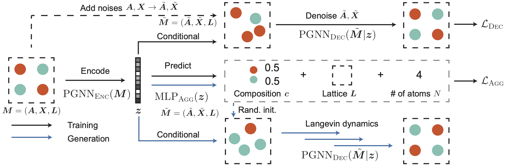
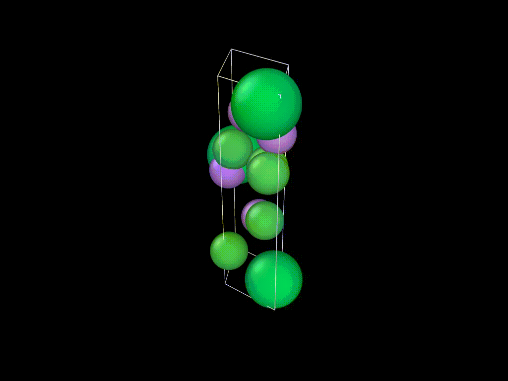

# Crystal Diffusion Variational AutoEncoder

This software implementes Crystal Diffusion Variational AutoEncoder (CDVAE), which generates the periodic structure of materials.

It has several main functionalities:

- Generate novel, stable materials by learning from a dataset containing existing material structures.
- Generate materials by optimizing a specific property in the latent space, i.e. inverse design.

[[Paper]](https://arxiv.org/abs/2110.06197) [[Datasets]](data/)

<p align="center">
   
</p>

<p align="center">
  
</p>


## Table of Contents

- [Installation](#installation)
- [Datasets](#datasets)
- [Training CDVAE](#training-cdvae)
- [Generating materials](#generating-materials)
- [Evaluating model](#evaluating-model)
- [Authors and acknowledgements](#authors-and-acknowledgements)
- [Citation](#citation)
- [Contact](#contact)

## Installation

The easiest way to install prerequisites is via [conda](https://conda.io/docs/index.html).

### GPU machines

Run the following command to install the environment:
```bash
conda env create -f env.yml
```
Activate the conda environment with `conda activate cdvae`.

Install this package with `pip install -e .`.

### Faster conda installation

We've noticed that the above command to install the dependencies from `env.yml` can take very long. A faster way to install the required packages is:
```bash
conda env create -f env_sub.yml
conda activate cdvae
conda install ipywidgets jupyterlab matplotlib pylint
conda install -c conda-forge matminer=0.7.3 nglview pymatgen=2020.12.31
pip install -e .
```

### CPU-only machines

```bash
conda env create -f env.cpu.yml
conda activate cdvae
pip install -e .
```

### Setting up environment variables

Make a copy of the `.env.template` file and rename it to `.env`. Modify the following environment variables in `.env`.

- `PROJECT_ROOT`: path to the folder that contains this repo
- `HYDRA_JOBS`: path to a folder to store hydra outputs
- `WABDB`: path to a folder to store wabdb outputs

## Datasets

All datasets are directly available on `data/` with train/valication/test splits. You don't need to download them again. If you use these datasets, please consider to cite the original papers from which we curate these datasets.

Find more about these datasets by going to our [Datasets](data/) page.

## Training CDVAE

### Training without a property predictor

To train a CDVAE, run the following command:

```
python cdvae/run.py data=perov expname=perov
```

To use other datasets, use `data=carbon` and `data=mp_20` instead. CDVAE uses [hydra](https://hydra.cc) to configure hyperparameters, and users can modify them with the command line or configure files in `conf/` folder.

After training, model checkpoints can be found in `$HYDRA_JOBS/singlerun/YYYY-MM-DD/expname`.

### Training with a property predictor

Users can also additionally train an MLP property predictor on the latent space, which is needed for the property optimization task:

```
python cdvae/run.py data=perov expname=perov model.predict_property=True
```

The name of the predicted propery is defined in `data.prop`, as in `conf/data/perov.yaml` for Perov-5.

## Generating materials

To generate materials, run the following command:

```
python scripts/evaluate.py --model_path MODEL_PATH --tasks recon gen opt
```

`MODEL_PATH` will be the path to the trained model. Users can choose one or several of the 3 tasks:

- `recon`: reconstruction, reconstructs all materials in the test data. Outputs can be found in `eval_recon.pt`l
- `gen`: generate new material structures by sampling from the latent space. Outputs can be found in `eval_gen.pt`.
- `opt`: generate new material strucutre by minimizing the trained property in the latent space (requires `model.predict_property=True`). Outputs can be found in `eval_opt.pt`.

`eval_recon.pt`, `eval_gen.pt`, `eval_opt.pt` are pytorch pickles files containing multiple tensors that describes the structures of `M` materials batched together. Each material can have different number of atoms, and we assume there are in total `N` atoms. `num_evals` denote the number of Langevin dynamics we perform for each material.

- `frac_coords`: fractional coordinates of each atom, shape `(num_evals, N, 3)`
- `atom_types`: atomic number of each atom, shape `(num_evals, N)`
- `lengths`: the lengths of the lattice, shape `(num_evals, M, 3)`
- `angles`: the angles of the lattice, shape `(num_evals, M, 3)`
- `num_atoms`: the number of atoms in each material, shape `(num_evals, M)`

## Evaluating model

To compute evaluation metrics, run the following command:

```
python scripts/compute_metrics.py --root_path MODEL_PATH --tasks recon gen opt
```

`MODEL_PATH` will be the path to the trained model. All evaluation metrics will be saved in `eval_metrics.json`.

## Authors and acknowledgements

The software is primary written by [Tian Xie](www.txie.me), with signficant contributions from [Xiang Fu](https://xiangfu.co/).

The GNN codebase and many utility functions are adapted from the [ocp-models](https://github.com/Open-Catalyst-Project/ocp) by the [Open Catalyst Project](https://opencatalystproject.org/). Especially, the GNN implementations of [DimeNet++](https://arxiv.org/abs/2011.14115) and [GemNet](https://arxiv.org/abs/2106.08903) are used.

The main structure of the codebase is built from [NN Template](https://github.com/lucmos/nn-template).

For the datasets, [Perov-5](data/perov_5) is curated from [Perovksite water-splitting](https://cmr.fysik.dtu.dk/cubic_perovskites/cubic_perovskites.html), [Carbon-24](data/carbon_24) is curated from [AIRSS data for carbon at 10GPa](https://archive.materialscloud.org/record/2020.0026/v1), [MP-20](data/mp_20) is curated from [Materials Project](https://materialsproject.org).

## Citation

Please consider citing the following paper if you find our code & data useful.

```
@article{xie2021crystal,
  title={Crystal Diffusion Variational Autoencoder for Periodic Material Generation},
  author={Xie, Tian and Fu, Xiang and Ganea, Octavian-Eugen and Barzilay, Regina and Jaakkola, Tommi},
  journal={arXiv preprint arXiv:2110.06197},
  year={2021}
}
```

## Contact

Please leave an issue or reach out to Tian Xie (txie AT csail DOT mit DOT edu) if you have any questions.
