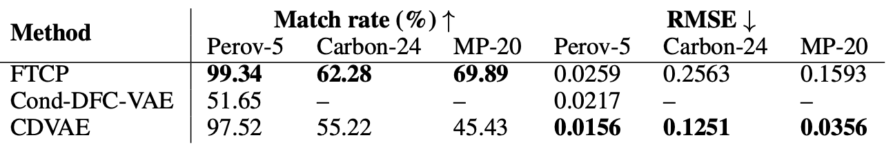
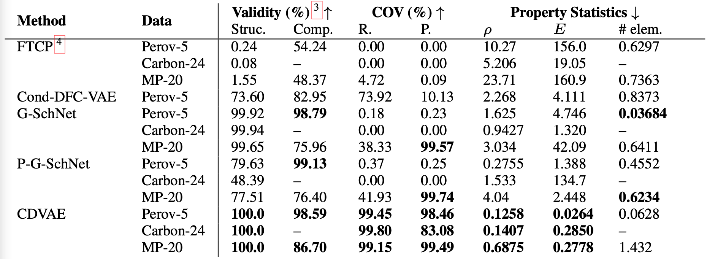
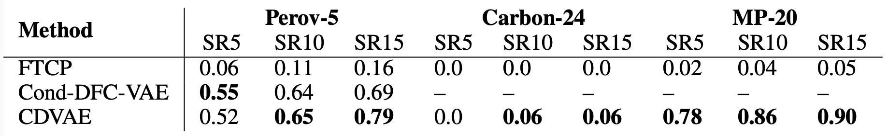

# Benchmark datasets for material generation

This directory contains 3 benchmark datasets for the problem of material generation, curated from the DFT calculations in cited papers:

- [Perov-5](perov_5) (Castelli et al., 2012): contains 19k perovksite materials, which share similar structure, but has different composition.

- [Carbon-24](carbon_24) (Pickard, 2020): contains 10k carbon materials, which share the same composition, but have different structures.

- [MP-20](mp_20) (Jain et al., 2013): contains 45k general inorganic materials, including most experimentally known materials with no more than 20 atoms in unit cell.

Detailed descriptions of the datasets and visualization of structures can be found by clicking the links.

## Baseline methods

- [FTCP](https://github.com/PV-Lab/FTCP) 
- [Cond-DFC-VAE](https://github.com/by256/icsg3d)
- [G-SchNet](https://github.com/atomistic-machine-learning/G-SchNet)
- P-G-SchNet (our periodically adapted version of G-SchNet)
- [CDVAE](https://github.com/txie-93/cdvae) (our model)

## Performances

Results are copied from our [paper](https://arxiv.org/abs/2110.06197). Detailed explanation of the tasks and metrics can also be found there.

### Reconstruction

<p align="center">
  
</p>

### Generation

<p align="center">
  
</p>

### Property optimization

<p align="center">
  
</p>

## Evaluating new models

If you develop a new model, you can use our evaluation scripts to obtain the metrics:

```
python scripts/compute_metrics.py --root_path ROOT_PATH --tasks recon gen opt
```

The script will read files named `eval_recon.pt`, `eval_gen.pt`, `eval_opt.pt` in `ROOT_PATH`, for the tasks of `recon`, `gen`, `opt` respectively. `*.pt` are pytorch pickles files containing multiple tensors that describes the structures of `M` materials batched together. They can be generated using a different code and evaluated using our script. Each material can have different number of atoms, and we assume there are in total `N` atoms. `num_evals` denote the number of Langevin dynamics we perform for each material.

- `frac_coords`: fractional coordinates of each atom, shape `(num_evals, N, 3)`
- `atom_types`: atomic number of each atom, shape `(num_evals, N)`
- `lengths`: the lengths of the lattice, shape `(num_evals, M, 3)`
- `angles`: the angles of the lattice, shape `(num_evals, M, 3)`
- `num_atoms`: the number of atoms in each material, shape `(num_evals, M)`

## Questions and comments

We hope these datasets and evaluation codes can be useful for the community to benchmark material generation models. If you have any questions or comments, please don't hesitate to reach out to Tian Xie (txie AT csail DOT mit DOT edu).

## Citation

Please consider citing the following paper if you find these datasets and evaluation metrics useful.

```
@article{xie2021crystal,
  title={Crystal Diffusion Variational Autoencoder for Periodic Material Generation},
  author={Xie, Tian and Fu, Xiang and Ganea, Octavian-Eugen and Barzilay, Regina and Jaakkola, Tommi},
  journal={arXiv preprint arXiv:2110.06197},
  year={2021}
}
```

In addition, please consider citing the original papers from which we curate these datasets.

Perov_5:

```
@article{castelli2012new,
  title={New cubic perovskites for one-and two-photon water splitting using the computational materials repository},
  author={Castelli, Ivano E and Landis, David D and Thygesen, Kristian S and Dahl, S{\o}ren and Chorkendorff, Ib and Jaramillo, Thomas F and Jacobsen, Karsten W},
  journal={Energy \& Environmental Science},
  volume={5},
  number={10},
  pages={9034--9043},
  year={2012},
  publisher={Royal Society of Chemistry}
}
```

```
@article{castelli2012computational,
  title={Computational screening of perovskite metal oxides for optimal solar light capture},
  author={Castelli, Ivano E and Olsen, Thomas and Datta, Soumendu and Landis, David D and Dahl, S{\o}ren and Thygesen, Kristian S and Jacobsen, Karsten W},
  journal={Energy \& Environmental Science},
  volume={5},
  number={2},
  pages={5814--5819},
  year={2012},
  publisher={Royal Society of Chemistry}
```

Carbon_24:

```
@misc{carbon2020data,
  doi = {10.24435/MATERIALSCLOUD:2020.0026/V1},
  url = {https://archive.materialscloud.org/record/2020.0026/v1},
  author = {Pickard,  Chris J.},
  keywords = {DFT,  ab initio random structure searching,  carbon},
  language = {en},
  title = {AIRSS data for carbon at 10GPa and the C+N+H+O system at 1GPa},
  publisher = {Materials Cloud},
  year = {2020},
  copyright = {info:eu-repo/semantics/openAccess}
}
```

MP_20:

```
@article{jain2013commentary,
  title={Commentary: The Materials Project: A materials genome approach to accelerating materials innovation},
  author={Jain, Anubhav and Ong, Shyue Ping and Hautier, Geoffroy and Chen, Wei and Richards, William Davidson and Dacek, Stephen and Cholia, Shreyas and Gunter, Dan and Skinner, David and Ceder, Gerbrand and others},
  journal={APL materials},
  volume={1},
  number={1},
  pages={011002},
  year={2013},
  publisher={American Institute of PhysicsAIP}
}
```

