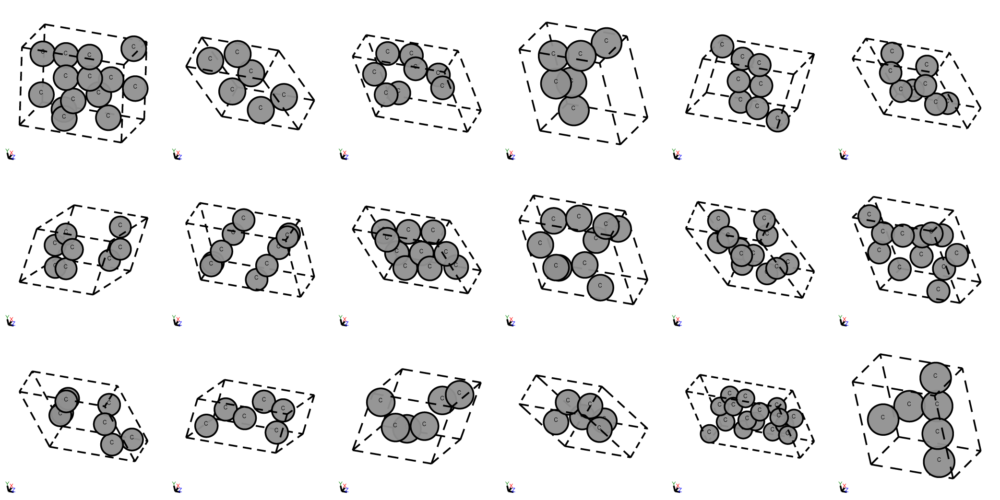

# Carbon-24

Carbon-24 contains 10k carbon materials, which share the same composition, but have different structures. There is 1 element and the materials have 6 - 24 atoms in the unit cells.

## What is in the dataset?

Carbon-24 includes various carbon structures obtained via *ab initio* random structure searching (AIRSS) (Pickard & Needs, 2006; 2011) performed at 10 GPa.

## Stabiity of curated materials

The original dataset includes 101529 carbon structures, and we selected the 10% of the carbon structure with the lowest energy per atom to create Carbon-24. All 10153 structures are at local energy minimum after DFT relaxation. The most stable structure is diamond at 10 GPa. All remaining structures are thermodynamically unstable but may be kinetically stable.

## Visualization of structures

<p align="center">
  
</p>

## Citation

Please consider citing the following paper:

```
@misc{carbon2020data,
  doi = {10.24435/MATERIALSCLOUD:2020.0026/V1},
  url = {https://archive.materialscloud.org/record/2020.0026/v1},
  author = {Pickard,  Chris J.},
  keywords = {DFT,  ab initio random structure searching,  carbon},
  language = {en},
  title = {AIRSS data for carbon at 10GPa and the C+N+H+O system at 1GPa},
  publisher = {Materials Cloud},
  year = {2020},
  copyright = {info:eu-repo/semantics/openAccess}
}
```

