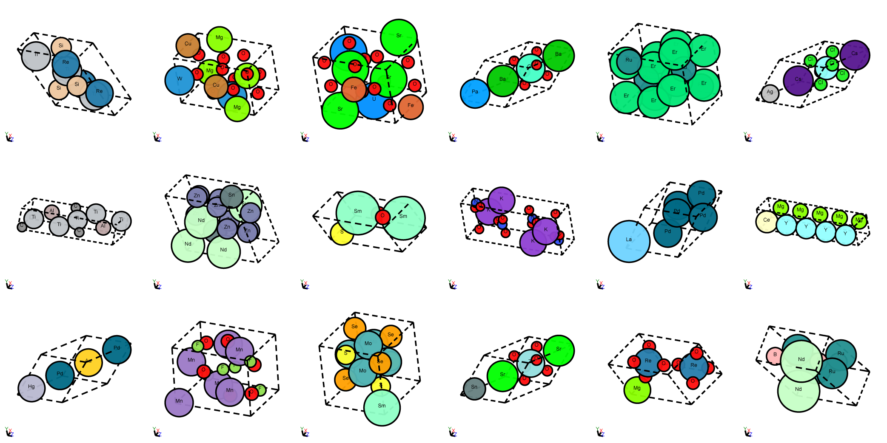

# MP-20

MP-20 contains 45231 general inorganic materials that differ in both structure and composition. There are 89 elements and the materials have 1 - 20 atoms in the unit cells. MP-20 includes most experimentally known materials with no more than 20 atoms in unit cell.

## What is in the dataset

MP-20 includes almost all experimentally stable materials from the Materials Project (Jain et al., 2013) with unit cells including at most 20 atoms. We only include materials that are originally from ICSD (Belsky et al., 2002) to ensure the experimental stability, and these materials represent the majority of experimentally known materials with at most 20 atoms in unit cells.

## Stability of curated materials

All 45231 are experimentally synthesizable. All materials are at local energy minimum after DFT relaxation. In addition, we only select materials with energy above the hull smaller than 0.08 eV/atom and formation energy smaller than 2 eV/atom.

## Visualization of structures

<p align="center">
  
</p>

## Citation

Please consider citing the following paper:

```
@article{jain2013commentary,
  title={Commentary: The Materials Project: A materials genome approach to accelerating materials innovation},
  author={Jain, Anubhav and Ong, Shyue Ping and Hautier, Geoffroy and Chen, Wei and Richards, William Davidson and Dacek, Stephen and Cholia, Shreyas and Gunter, Dan and Skinner, David and Ceder, Gerbrand and others},
  journal={APL materials},
  volume={1},
  number={1},
  pages={011002},
  year={2013},
  publisher={American Institute of PhysicsAIP}
}
```


