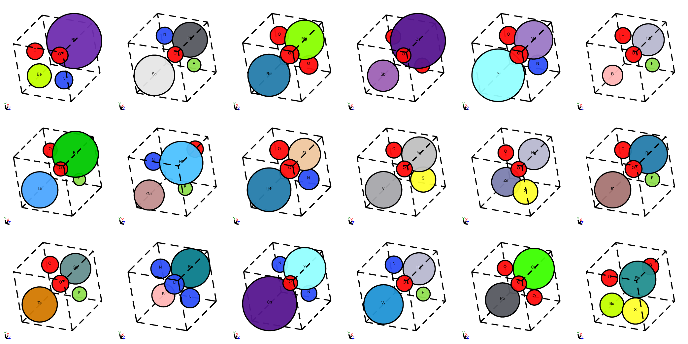

# Perov-5

Perov-5 contains 18928 perovskite materials, which share similar structure, but has different composition. There are 56 elements and all materials have 5 atoms in the unit cell.

## What is in the dataset?

Perovskite is a class of materials that share a similar structure and have the general chemical formula ABX3. The ideal perovskites have a cubic structure, where the site A atom sits at a corner position, the site B atom sits at a body centered position and site X atoms sit at face centered positions. Most structures in Perov-5 will signficantly deviate from the ideal cubic structure because the distorted structure has a lower energy.

## Stability of curated materials

All 18928 materials in the original database are included. All materials are at local energy minimum after DFT relaxation. A significant portion of the materials are not thermodynamically stable, i.e., they will decompose to nearby phases and cannot be synthesized.

## Visualization of structures

<p align="center">
  
</p>

## Citation

Please consider citing the following two papers:

```
@article{castelli2012new,
  title={New cubic perovskites for one-and two-photon water splitting using the computational materials repository},
  author={Castelli, Ivano E and Landis, David D and Thygesen, Kristian S and Dahl, S{\o}ren and Chorkendorff, Ib and Jaramillo, Thomas F and Jacobsen, Karsten W},
  journal={Energy \& Environmental Science},
  volume={5},
  number={10},
  pages={9034--9043},
  year={2012},
  publisher={Royal Society of Chemistry}
}
```

```
@article{castelli2012computational,
  title={Computational screening of perovskite metal oxides for optimal solar light capture},
  author={Castelli, Ivano E and Olsen, Thomas and Datta, Soumendu and Landis, David D and Dahl, S{\o}ren and Thygesen, Kristian S and Jacobsen, Karsten W},
  journal={Energy \& Environmental Science},
  volume={5},
  number={2},
  pages={5814--5819},
  year={2012},
  publisher={Royal Society of Chemistry}
}
```


